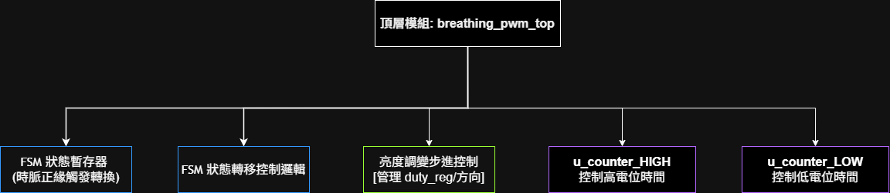
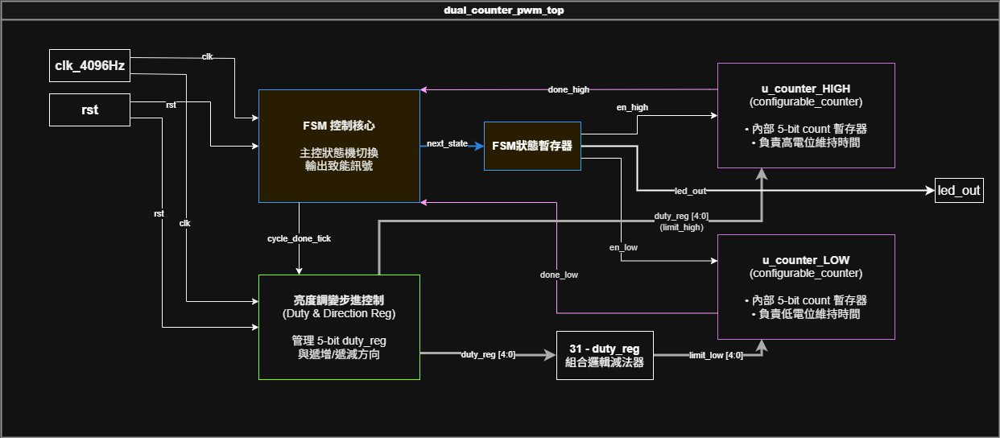
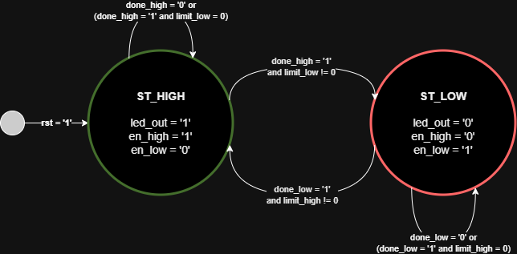
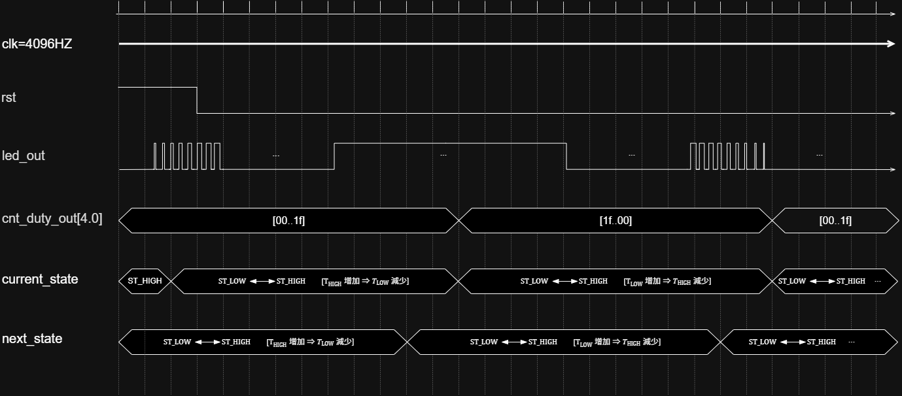
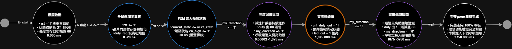

# Project 4: 基於 FSM 控制雙計數器的 PWM 呼吸燈

本專案使用 **VHDL** 語言在 **Xilinx Vivado** 環境下開發，實現了一個具備硬體優化的 PWM 呼吸燈控制系統。系統核心採用狀態機（FSM）動態控制兩個可配置計數器（`configurable_counter`）。

---

## 專案特點

* **雙計數器獨立控制**：高電位時間與低電位時間分別由兩個獨立的子模組計數器管理，動態載入上限值（Limit）。
* **預判機制**：FSM 在狀態轉換前，會先行檢查下一個狀態的 `limit` 是否為 0。若為 0 則直接保持當前狀態，達到 100% 與 0% Duty Cycle 的乾淨波形輸出。
* **純淨狀態機輸出**：`led_out` 的輸出完全由 FSM 當前狀態（Current State）決定（High 狀態輸出 `1`，Low 狀態輸出 `0`），符合嚴格的同步數位電路設計規範。
* **動態亮度步進**：內建減速器，每 8 個 PWM 週期更新一次亮度分數（0 至 31），呈現平滑的呼吸視覺效果。

---

## 一、 系統設計與硬體架構

### 1. 系統架構與模組階層 (Module Breakdown)
本系統由頂層模組控制，內部拆解出底層的可配置計數器（Configurable Counter）與亮度減速控制器，達到模組化設計。

### 2. 系統電路圖與硬體方塊圖 (Hardware Block Diagram)
電路走線包含時脈輸入、非同步重置鎖定、以及 FSM 與計數器之間的動態 Limit 載入總線。

### 3. 有限狀態機控制核心 (FSM State Diagram)
FSM 在 `ST_HIGH` 與 `ST_LOW` 之間切換。當 done 訊號滿足且預判下一個狀態的上限值不為 0 時跳變；若為極端工作週期（0% 或 100%），則利用預判機制鎖定當前狀態，輸出完美直線。

---

## 二、 訊號與時序規範

### 1. 訊號說明

| 端口/訊號名稱 | 方向 | 型態 | 功能描述 |
| --- | --- | --- | --- |
| `clk_4096Hz` | Input | `std_logic` | 系統主時脈輸入 (4096 Hz) |
| `rst` | Input | `std_logic` | 主非同步重置訊號 (高電位有效) |
| `led_out` | Output | `std_logic` | PWM 輸出訊號，用於驅動呼吸燈 LED |
| `cnt_duty_out` | Output | `std_logic_vector(4 downto 0)` | 5-bit 當前亮度分數輸出 (0 ~ 31) |

### 2. 系統時序規範與約束 (Time Spec)
明確定義各硬體模組在時脈沿觸發下的建立時間（Setup Time）與保持時間（Hold Time）規範。

---

## 三、 Testbench 模擬與精確時間軸節點

### 1. Testbench 模擬執行流程 (Activity-on-Vertex, AoV 圖)
描述模擬啟動後，從重置、釋放、進入呼吸循環到 4 秒截止的完整生命週期節點。

### 2. 精確功能模擬時間軸節點說明 (Behavioral Timing)
以硬體電路在 Testbench 模擬執行時，單次完整呼吸週期共 **3,750 ms** 為基準，各重要硬體事件的精確時間點如下：

* **0.000 ms — 模擬啟動**：`rst = '1'` 主重置啟動，狀態機強制維持在 `ST_HIGH`，亮度暫存器 `cnt_duty_out` 初始為 `00`。
* **0.244 ms — 時脈首沿**：`clk_4096Hz` 迎來第一個上升沿（週期為 244.14 us），內部同步清除機制準備就緒。
* **1.000 ms — 釋放重置**：Testbench 結束開機等待，`rst` 釋放轉為 `'0'` 系統解鎖，計數器動態計算並準備載入第一個上限。
* **1.098 ms — 狀態首轉**：解鎖後的第一個有效時脈沿，偵測 `done_high = '1'` 成立，FSM 精確切換至 `ST_LOW` 狀態。
* **8.662 ms — PWM 週期首滿**：低電位計數器跑滿 31 個週期，`done_low` 觸發期滿，FSM 回切至 `ST_HIGH`。
* **1.000 ms ~ 1,875.000 ms — 亮度遞增區間**：減速計數器每 8 個 PWM 週期更新一次，亮度分數從 `00` 逐級平滑遞增。
* **1,875.000 ms — 亮度最高峰值（關鍵紅圈觀測點）**：
  > 漸亮階段結束，亮度達到最頂峰 **`cnt_duty_out = 1F`**。此時內部預判機制偵測到 `limit_low = 0`（全亮），FSM 啟動極端邊界鎖定，控制線不進行狀態切換，**`led_out = 1` 保持純淨恆亮直線**。
* **1,875.000 ms ~ 3,750.000 ms — 亮度遞減區間**：通過最高峰值後，亮度分數開始從 `1F` 逐級對稱遞減，呼吸燈進入變暗階段。
* **3,750.000 ms — 單次呼吸完工**：完美走完 100% 的暗 → 亮 → 暗波形，準備進入下一次呼吸循環。
* **4,000.000 ms — 四秒波形截止**：滿足 Vivado 的 `run 4 s` 模擬限制，成功擷取無任何邏輯毛邊的完整呼吸燈功能波形。

---

## 四、 實體佈線後時序延遲與硬體穩健性分析 (Post-Routing Timing Analysis)

本專案除了驗證上述理想功能模擬外，進一步通過了 Vivado 的 **Post-Implementation Timing Simulation（實體佈線後時序模擬）**，用以檢驗實體硬體在真實晶片走線下的物理表現。

### 理想行為模擬 vs. 佈線後實體時序對比

透過分析專案中的功能模擬圖與繞線後時序波形圖，可以歸納出以下關鍵差異：

| 評比項目 | Behavioral Simulation (功能模擬) `[理想時序波形]` | Post-Implementation Simulation (佈線後時序) `[真實硬體波形]` |
| --- | --- | --- |
| **延遲效應模型** | **零延遲模型 (Zero-Delay)** 所有內部訊號與時脈邊緣百分之百同步。 | **實體物理延遲 (Propagation Delay)** 包含 LUT 閘延遲與晶片內部金屬走線延遲。 |
| **開機不確定態** | 在模擬啟動初始階段（0~20ns 重置期），各訊號直接瞬間呈現乾淨的電位值。 | 在開機前數奈秒 (ns)，因內部硬件線路尚未就緒且存在初始建立時間，輸出端會伴隨短暫的**紅色不確定態（X 態）**。 |
| **亮度跳變沿觀測** | 當時脈沿觸發，亮度分數 `cnt_duty_out` 與狀態控制線無縫同步切換。 | 當 `clk_4096Hz` 上升沿觸發後，`cnt_duty_out` 需經歷一小段傳播延遲才完成新資料鎖存。 |
| **極端邊界完整度** | 在 0% 或 100% 邊界時，訊號在理論上絕對維持一條直線。 | 即使在真實硬體走線下，得益於獨創的預判鎖定機制，**依舊維持完美直線**，成功通過實體驗證。 |

---

## 五、 模擬與驗證指引 (How to Run)

### 模擬設定

* **開發工具**：Vivado 2022.2 (或更高版本)
* **時脈週期**：`244.14 us` (1 / 4096 Hz)
* **建議模擬時間**：單次完整呼吸（暗 → 亮 → 暗）需要 **3.75 秒**，因此在 Vivado 跑模擬時，請將 Simulation Time 設定為 `4s` 以上。

### 運行步驟

1. 將 `src/` 資料夾下的 VHDL 檔案加入 Vivado 的 **Design Sources**。
2. 將 `sim/` 資料夾下的 Testbench 檔案加入 Vivado 的 **Simulation Sources**。
3. 點擊左側選單 **Run Simulation -> Run Behavioral Simulation** 觀測理想功能波形（可特別對照 **1,875 ms** 紅圈處的 `1F` 恆亮波形）。
4. 點擊 **Run Simulation -> Run Post-Implementation Timing Simulation** 驗證實體佈線後的真實硬體時序與走線延遲。
5. 在 Tcl Console 輸入 `run 4 s` 即可觀測到完整的呼吸燈波形。驗證 `led_out` 在極端工作週期（`cnt_duty_out = 1F` 與 `00`）時，是否皆能保持完美純淨的連續直線。
