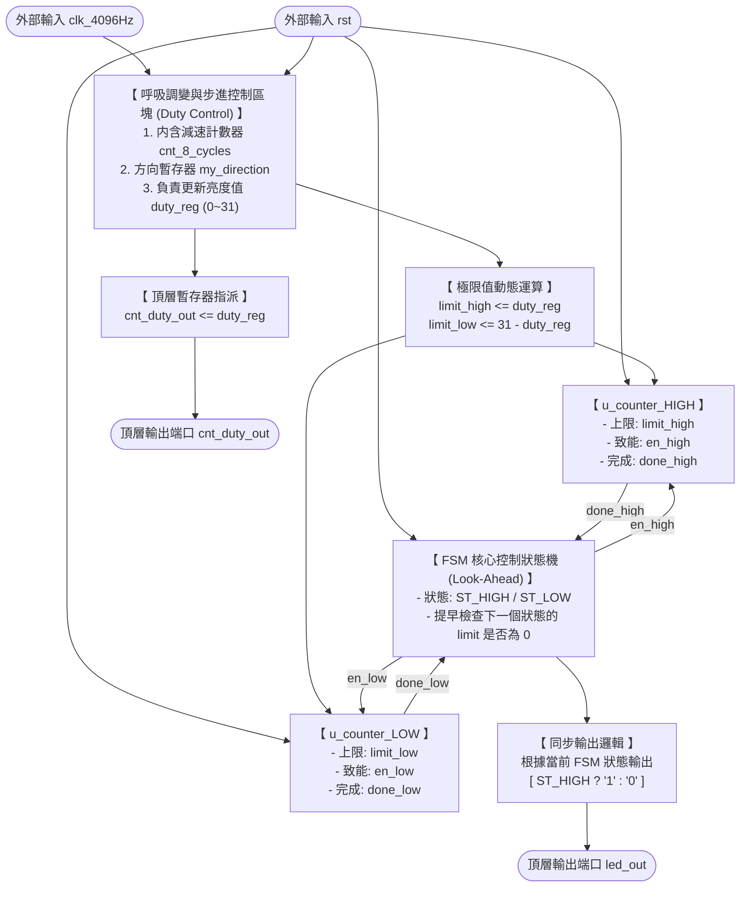

# Project 4: 基於 FSM 控制雙計數器的 PWM 呼吸燈

本專案使用 **VHDL** 語言在 **Xilinx Vivado** 環境下開發，實現了一個具備硬體優化的 PWM 呼吸燈控制系統。系統核心採用狀態機（FSM）動態控制兩個可配置計數器（`configurable_counter`），並加入 **Look-Ahead（前瞻預判）** 邏輯，完美解決了傳統雙計數器架構在極端工作週期（全亮/全暗）切換時產生的時脈突波（Glitch）問題。

---

## 專案特點

* **雙計數器獨立控制**：高電位時間與低電位時間分別由兩個獨立的子模組計數器管理，動態載入上限值（Limit）。
* **Look-Ahead 預判機制**：FSM 在狀態轉換前，會先行檢查下一個狀態的 `limit` 是否為 0。若為 0 則直接保持當前狀態，達到 100% 與 0% Duty Cycle 的純淨波形輸出。
* **純淨狀態機輸出**：`led_out` 的輸出完全由 FSM 當前狀態（Current State）決定（High 狀態輸出 `1`，Low 狀態輸出 `0`），符合嚴格的同步數位電路設計規範。
* **動態亮度步進**：內建減速器，每 8 個 PWM 週期更新一次亮度分數（0 至 31），呈現平滑的呼吸視覺效果。

---

## 系統架構

### 1. 硬體區塊圖 (Block Diagram)



### 2. FSM 狀態轉移邏輯

* **ST_HIGH**：啟用高電位計數器。當 `done_high = '1'` 時，若 `limit_low = 0`（全亮），則保持 `ST_HIGH`；否則轉移至 `ST_LOW`。
* **ST_LOW**：啟用低電位計數器。當 `done_low = '1'` 時，若 `limit_high = 0`（全暗），則保持 `ST_LOW`；否則轉移至 `ST_HIGH`。

---

## 檔案結構

```bash
├── src/
│   ├── configurable_counter.vhd  # 可配置計數器子模組
│   └── breathing_pwm_top.vhd     # 系統頂層模組 (含 FSM 與步進控制)
└── sim/
    └── tb_dual_counter_pwm.vhd   # Testbench 模擬平台

```

---

## 訊號說明

| 端口/訊號名稱 | 方向 | 型態 | 功能描述 |
| --- | --- | --- | --- |
| `clk_4096Hz` | Input | `std_logic` | 系統主時脈輸入 (4096 Hz) |
| `rst` | Input | `std_logic` | 主非同步重置訊號 (高電位有效) |
| `led_out` | Output | `std_logic` | PWM 輸出訊號，用於驅動呼吸燈 LED |
| `cnt_duty_out` | Output | `std_logic_vector(4 downto 0)` | 5-bit 當前亮度分數輸出 (0 ~ 31) |

---

## 模擬與驗證

### 模擬設定

* **開發工具**：Vivado 2022.2 (或更高版本)
* **時脈週期**：`244.14 us` ($1 / 4096 \text{ Hz}$)
* **建議模擬時間**：單次完整呼吸（暗 $\rightarrow$ 亮 $\rightarrow$ 暗）大約需要 **3.75 秒**，因此在 Vivado 跑模擬時，請將 Simulation Time 設定為 `4s` 以上。

### 驗證結果

經由 Vivado 時序模擬驗證，專案波形完美呈現以下三個呼吸階段：

1. **漸亮階段**：隨著 `cnt_duty_out` 從 `00` 遞增至 `18`，`led_out` 的高電位脈衝寬度線性變寬。
2. **全亮過渡**：當 `cnt_duty_out` 到達最大值 `1F`（31）時，Look-Ahead 機制使 `led_out` 保持為一條純淨的連續高電位直線，無任何下跳突波（Glitch）。
3. **漸暗階段**：亮度由 `1F` 遞減至 `00`，`led_out` 高電位寬度縮窄，並在 `00` 時穩定輸出純低電位。

---

## 如何在 Vivado 中運行

1. 打開 Vivado 並建立一個新專案（Target Device 依你的 FPGA 板子而定）。
2. 將 `src/` 資料夾下的 VHDL 檔案加入成 **Design Sources**。
3. 將 `sim/` 資料夾下的 Testbench 檔案加入成 **Simulation Sources**。
4. 點擊左側 Flow Navigator 中的 **Run Simulation** $\rightarrow$ **Run Behavioral Simulation**。
5. 在 Tcl Console 輸入 `run 4 s` 即可觀測到完整的呼吸燈波形。
