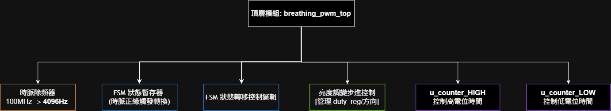
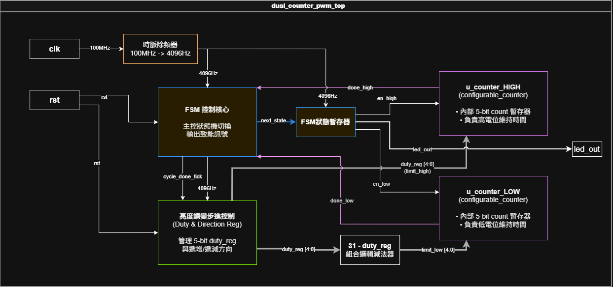
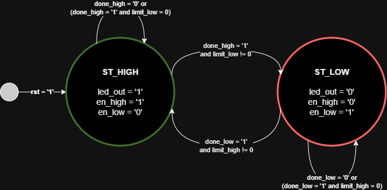
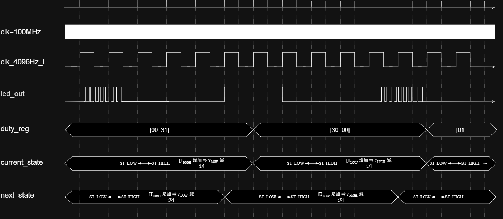
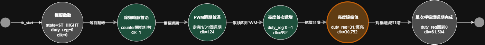

# Project 4: 基於 FSM 控制雙計數器的 PWM 呼吸燈

本專案使用 **VHDL** 語言在 **Xilinx Vivado** 環境下開發，實現了一個具備硬體優化的 PWM 呼吸燈控制系統。系統核心採用狀態機（FSM）動態控制兩個可配置計數器（`configurable_counter`）。

---

## 專案特點

* **雙計數器獨立控制**：高電位時間與低電位時間分別由兩個獨立的子模組計數器管理，動態載入上限值（Limit）。
* **預判機制**：FSM 在狀態轉換前，會先行檢查下一個狀態的 `limit` 是否為 0。若為 0 則直接保持當前狀態，達到 100% 與 0% Duty Cycle 的乾淨波形輸出。
* **純淨狀態機輸出**：`led_out` 的輸出完全由 FSM 當前狀態（Current State）決定（High 狀態輸出 `1`，Low 狀態輸出 `0`），符合嚴格的同步數位電路設計規範。
* **動態亮度步進**：內建減速器，每 8 個 PWM 週期更新一次亮度分數（0 至 31），呈現平滑的呼吸視覺效果。
* **單一頂層整合設計**：`breathing_pwm_top` 本身直接吃板上原生的 `100MHz`，內部自行除頻出約 `4096Hz` 給 FSM／計數器邏輯使用，不需要額外的燒板專用 wrapper 模組，介面圖只有這一個方塊。

---

## 一、 系統設計與硬體架構

### 1. 系統架構與模組階層 (Module Breakdown)
本系統由頂層模組控制，內部拆解出底層的可配置計數器（Configurable Counter）與亮度減速控制器，達到模組化設計。

> **提醒**：這張圖是介面調整前畫的，如果圖上標示的頂層輸入還是 `clk_4096Hz`，需要更新成 `clk`（`100MHz`），並且補上內部新增的除頻方塊——這是這次介面整合後唯一需要跟著改的地方，其餘子模組階層完全沒變。

### 2. 系統電路圖與硬體方塊圖 (Hardware Block Diagram)
電路走線包含時脈輸入、內部除頻、以及 FSM 與計數器之間的動態 Limit 載入總線。

> 同上，`rst` 現在是內部直接接死 `'0'`（不再是外部輸入接腳），如果圖上還畫著外部 `rst` 輸入線，這條也需要拿掉。

### 3. 有限狀態機控制核心 (FSM State Diagram)
FSM 在 `ST_HIGH` 與 `ST_LOW` 之間切換。當 done 訊號滿足且預判下一個狀態的上限值不為 0 時跳變；若為極端工作週期（0% 或 100%），則利用預判機制鎖定當前狀態，輸出完美直線。這部分邏輯完全沒有因為這次介面整合而改變。

---

## 二、 訊號與時序規範

### 1. 訊號說明

| 端口/訊號名稱 | 方向 | 型態 | 功能描述 |
| --- | --- | --- | --- |
| `clk` | Input | `std_logic` | 板上原生系統時脈輸入 (100 MHz)，取代原本的 `clk_4096Hz` 外部輸入 |
| `led_out` | Output | `std_logic` | PWM 輸出訊號，用於驅動呼吸燈 LED |
| `cnt_duty_out` | Output | `std_logic_vector(4 downto 0)` | 5-bit 當前亮度分數輸出 (0 ~ 31)，除錯觀察用 |

| Generic 名稱 | 型態 | 預設值 | 功能描述 |
| --- | --- | --- | --- |
| `DIV_N` | `integer` | `12207` | 100MHz 除頻倍率，實際頻率 = 100MHz/(2×DIV_N)，預設值對應約 4096.02Hz；模擬時可以調小，加快跑完一次呼吸週期所需的模擬時間 |

`rst` 不再是外部 port：所有內部暫存器宣告時都已給了正確初始值（`duty_reg:=0`、`my_direction:='1'`、`cnt_8_cycles:=0`；`current_state` 沒有顯式初始化，但依 VHDL 規則會取列舉型別的第一個值，也就是 `ST_HIGH`），FPGA 組態載入本身就會套用這些初始值，架構內部直接把 `rst` 接死在 `'0'`，不需要額外的重置動作或按鍵。

### 2. 系統時序規範與約束 (Time Spec)
明確定義各硬體模組在時脈沿觸發下的建立時間（Setup Time）與保持時間（Hold Time）規範。

> 這張圖如果畫出了外部 `clk_4096Hz`/`rst` 輸入的時序關係，也需要對應更新成內部除頻訊號 `clk_4096Hz_i` 的時序，並拿掉 `rst` 的部分。

---

## 三、 Testbench 模擬與精確時間軸節點

### 1. Testbench 模擬執行流程 (Activity-on-Vertex, AoV 圖)
描述模擬啟動後，從第一個除頻時脈沿、進入呼吸循環到單次週期結束的完整生命週期節點。

> 這張圖需要整個重畫：原本以「`rst` 釋放」為起點的敘事已經不適用（`rst` 不再是外部可驅動的訊號），現在的起點是「模擬開始、時脈啟動」；圖上所有具體的時間數字（`0.244ms`、`1.000ms`、`8.662ms`、`1,875ms`、`3,750ms` 這些）也全部要換成下方重新算過的數字。

### 2. 精確功能模擬時間軸節點說明 (Behavioral Timing)

現在的 testbench（`tb_dual_counter_pwm.vhd`）直接產生真正的 `100MHz` 時脈（週期 `10ns`），並把 `DIV_N` 這個 generic 從硬體的 `12207` 降到 `2`，讓內部除頻出來的 `clk_4096Hz_i` 週期變成 `40ns`（硬體上是真正的 `244.14us`，這裡刻意壓縮成模擬好操作的規模，只影響模擬時間長短，不影響電路邏輯本身）。以這組數字為基準，單次完整呼吸週期共 **615,040 ns（615.04 us）**，各重要事件的精確時間點如下：

* **0 ns — 模擬啟動**：所有暫存器套用宣告時的初始值，`current_state` 為 `ST_HIGH`，`cnt_duty_out` 為 `00000`。因為 `rst` 已經內部接死，不再有「重置期」這個階段，系統從時脈一開始跑就直接進入正常運作。
* **15 ns — 除頻時脈首沿**：`clk_4096Hz_i` 迎來第一個上升沿（週期 `40ns`），`u_counter_HIGH`／`u_counter_LOW` 開始真正計數。
* **1,240 ns — PWM 週期首滿**：`limit_high`＋`limit_low` 固定等於 `31`，第一次 `ST_HIGH`＋`ST_LOW` 完整走完一輪，共花費 `31×40ns=1,240ns`。
* **9,920 ns — 亮度首次遞增**：減速計數器 `cnt_8_cycles` 累積滿 `8` 次 PWM 週期（`8×1,240ns`），亮度分數 `duty_reg` 第一次從 `00` 遞增到 `01`。
* **307,520 ns — 亮度最高峰值（對應原本「1,875ms 紅圈」節點）**：走完 `31` 階遞增（`31×9,920ns`），`cnt_duty_out = 1F`（`11111`）到達最頂峰。此時內部預判機制偵測到 `limit_low=0`（全亮），FSM 啟動極端邊界鎖定，控制線不進行狀態切換，**`led_out=1` 保持純淨恆亮直線**。
* **307,520 ns ~ 615,040 ns — 亮度遞減區間**：通過最高峰值後，亮度分數開始從 `1F` 逐級對稱遞減，呼吸燈進入變暗階段。
* **615,040 ns — 單次呼吸完工**：完美走完暗 → 亮 → 暗波形，`duty_reg` 回到 `00`，準備進入下一次呼吸循環。

---

## 四、 硬體佈線相關的除錯經驗

這次把 `breathing_pwm_top` 從「吃外部 `clk_4096Hz`」改成「吃真正的 `100MHz`、內部自己除頻」，過程中遇到幾個值得記錄下來的坑：

* **`DRC NSTD-1`／`UCIO-1` 在這個 Vivado 版本上是硬性錯誤，不是警告**：任何沒有指定 `IOSTANDARD`／`PACKAGE_PIN` 的 port（包括除錯用、沒打算接實體接腳的 `cnt_duty_out`）都會直接擋掉 `Generate Bitstream`。要嘛把這些 port 也接上實體接腳，要嘛用 `set_property SEVERITY {Warning} [get_drc_checks NSTD-1]` 之類的指令主動降級，兩者擇一，不能放著不管。
* **`create_generated_clock` 用內部訊號名稱 pattern 比對，如果比對不到，可能導致 XDC 檔案後續內容整段沒被套用**：這次呼吸燈的時序需求非常寬鬆（單純的除頻方波，沒有嚴苛的資料路徑），不值得為了正式宣告一個內部除頻時脈去冒這個風險，最後直接拿掉這段宣告，只保留必要的實體接腳約束，問題就解決了。
* **不同板子的 pin 對應關係不能互相套用**：曾經一度誤用了另一塊開發板（`ZedBoard`）的 LED 接腳對照表，即使兩塊板子用的是同一顆晶片，實際焊接的 pin 位置也不一定相同，燒板前務必以自己手上這塊板子的手冊為準。
* **`configurable_counter.vhd` 完全不需要跟著修改**：因為它的 `clk` port 本來就寫成通用名稱、不綁定特定頻率，只要在 `port map` 那一端把它接到正確的訊號（原本的外部 `clk_4096Hz`，現在的內部 `clk_4096Hz_i`）即可，不需要動這個模組本身任何一行。

---

## 五、 模擬與驗證指引 (How to Run)

### 模擬設定

* **開發工具**：Vivado 2022.2（或更高版本）
* **實際時脈週期**：`10 ns`（`100MHz`，跟這整個系列的專案一致）
* **模擬用除頻倍率**：`DIV_N=2`（`generic map` 覆寫，硬體實際用 `12207`）
* **建議模擬時間**：`700 us` 以上，可涵蓋一次完整呼吸週期（`615,040 ns`）並留有餘裕

### 運行步驟

1. 將 `src/` 資料夾下的 `breathing_pwm_top.vhd`、`configurable_counter.vhd` 加入 Vivado 的 **Design Sources**，`Top Module` 直接設成 `breathing_pwm_top`（不需要額外的燒板 wrapper）。
2. 將 `sim/tb_dual_counter_pwm.vhd` 加入 Vivado 的 **Simulation Sources**。
3. 點擊左側選單 **Run Simulation → Run Behavioral Simulation**，在 Tcl Console 輸入 `run 700 us`，觀測理想功能波形（可特別對照 **307,520 ns** 附近的 `1F` 恆亮波形）。
4. 燒板前套用 `constraints/breathing_pwm_hw.xdc`，並視需要在 Tcl Console 執行 `set_property SEVERITY {Warning} [get_drc_checks NSTD-1]`、`set_property SEVERITY {Warning} [get_drc_checks UCIO-1]`，讓 `cnt_duty_out` 這個除錯用 port 不會擋住出檔。
5. 執行 `Run Synthesis → Run Implementation → Generate Bitstream`，燒錄至 `EGO-XZ7`。
